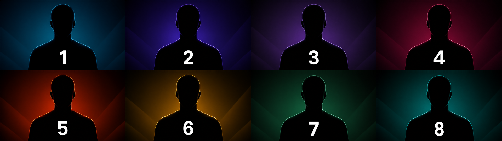

# Tractus Presenter Test for NDI

[](https://github.com/tractusevents/Tractus.PresenterTestForNDI/actions/workflows/ci.yml)
[](LICENSE)
[](#requirements)

A compact Windows utility that generates up to eight independent, unmistakable presenter test sources. Every output is continuously clocked at 1920×1080 progressive, 30 fps, with optional synchronized identification audio.



## Features

- One to eight independently discoverable 1920×1080p30 NDI sources.
- Eight centered, numbered presenter silhouettes with coordinated background colors.
- Per-source 48 kHz stereo identification tones.
- Individual **Tone**, **Silence**, or **No Audio** selection.
- **Tone All**, **Silence All**, and configurable **Tone Chase** program modes.
- Tone Chase advances one audible presenter at a time every two seconds by default.
- Per-presenter custom image import with automatic EXIF orientation, 16:9 center-cropping, and 1920×1080 normalization.
- Persistent source names, audio settings, source count, and custom images.
- Dark-mode WPF interface plus a headless command-line mode.

## Requirements

- Windows 10 or later, x64.
- NDI 6.3 runtime.
- A network and computer with sufficient capacity for the selected source count.

The packaged release is self-contained and does not require a separate .NET installation.

## Download and run

1. Install the current [NDI Tools for Windows](https://ndi.video/tools/?download=windows), which supplies the required NDI runtime.
2. Download the latest Windows ZIP from [GitHub Releases](https://github.com/tractusevents/Tractus.PresenterTestForNDI/releases/latest).
3. Extract the complete ZIP and run `TractusPresenterTestForNDI.exe`.
4. Select **Start Sources**.

The default source names are `Presenter Test 1` through `Presenter Test 8`. Windows may request network access the first time the sender starts; follow your organization's network and firewall policy.

Release builds are currently unsigned. Verify the published SHA-256 checksum and follow your organization's software policy before running them.

> [!CAUTION]
> Eight full-bandwidth 1080p30 sources can place substantial load on a computer and network. Start with fewer sources when testing on constrained systems.

## Audio identification

Audio starts in **Silence All** mode at -20 dBFS, keeping audio channels present without producing a tone.

| Presenter | Tone |
|---:|---:|
| 1 | 400 Hz |
| 2 | 500 Hz |
| 3 | 630 Hz |
| 4 | 800 Hz |
| 5 | 1000 Hz |
| 6 | 1250 Hz |
| 7 | 1600 Hz |
| 8 | 2000 Hz |

**Tone Chase** enables exactly one tone at a time and moves sequentially through the running sources. The interval and level are adjustable while the application is open.

## Custom images

The bundled silhouettes are always available as defaults. While sources are stopped, select **Change image** on any presenter card to import PNG, JPEG, BMP, GIF, or TIFF artwork. The application copies and normalizes the image into its per-user data folder. Select **Default** to restore the bundled silhouette.

Custom images and settings are stored under:

```text
%LOCALAPPDATA%\Tractus\Presenter Test for NDI
```

User-supplied images are not uploaded to a cloud service by the application. When sources are started, the selected artwork is transmitted as that presenter's NDI video content on the configured network.

## Headless mode

```powershell
.\TractusPresenterTestForNDI.exe --headless `
  --count 8 `
  --name-prefix "Presenter Test" `
  --audio chase `
  --tone-level-db -20 `
  --chase-seconds 2
```

Available audio programs are `individual`, `tone`, `silence`, `none`, and `chase`. Press Ctrl+C to stop a headless session.

Generate BMP previews without initializing NDI:

```powershell
.\TractusPresenterTestForNDI.exe --preview .\previews
```

## Build and test

Building requires Windows x64 and the .NET 10 SDK. The NDI runtime is only required for live sender testing.

```powershell
dotnet restore .\tests\TractusPresenterTest.Tests.csproj
dotnet build .\TractusPresenterTestForNDI.csproj -c Release
dotnet test .\tests\TractusPresenterTest.Tests.csproj -c Release
```

Create a self-contained Windows release:

```powershell
dotnet publish .\TractusPresenterTestForNDI.csproj `
  -c Release `
  -r win-x64 `
  --self-contained true `
  -p:PublishSingleFile=true `
  -p:IncludeNativeLibrariesForSelfExtract=true
```

The application uses [NDILibDotNetAdvanced](https://github.com/tractusevents/NdiLibDotNetAdvanced) for NDI interoperability. The NDI runtime itself is not included in this repository or its release package.

## Contributing

See [CONTRIBUTING.md](CONTRIBUTING.md). Changes should keep silent startup as the safe default and include relevant automated or live NDI testing.

## License and trademark

Source code and bundled presenter artwork are available under the [MIT License](LICENSE). Third-party notices are listed in [THIRD-PARTY-NOTICES.md](THIRD-PARTY-NOTICES.md).

NDI® is a registered trademark of Vizrt NDI AB. Tractus Presenter Test for NDI is not affiliated with or endorsed by Vizrt NDI AB.
